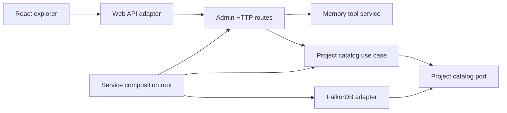

# Architecture brief — stage 6 administration UI

Date: 2026-08-30

## 1. Goal

- Business outcome: a human can inspect what MemoryOS believes, why it believes it, where that evidence came from, what conflicts with it, and how it changed over time.
- Actors: developer/operator; the existing service is the only data owner.
- In scope: project catalog/overview, hybrid search, Claim explanation, Evidence/provenance, conflict candidates, and immutable history in a local React SPA.
- Out of scope: generic graph editing, automatic conflict resolution, Claim lifecycle mutation before those domain commands exist, remote authentication, and visualization of every raw graph edge.
- Success: the primary `WHY DO WE BELIEVE THIS?` flow is covered by a browser E2E test and the SPA is served by the same local service.

## 2. Domain model and invariants

- A Project is the isolation boundary and is selected explicitly by stable id.
- Search results are summaries; Claim explanation is the authoritative detail view for evidence and provenance.
- Conflict candidates remain candidates. The UI must not label them as automatically resolved contradictions.
- History is immutable and ordered; UI filtering cannot reinterpret event content.
- The browser never connects to FalkorDB, Ollama, or MCP. It uses a versioned Admin HTTP read contract.
- Administrative writes remain absent until the corresponding domain use cases and audit semantics are implemented.

## 3. Existing architecture impact

- Existing retrieval and memory-tool application services already own search, explanation, conflicts, and history.
- Projects gains a read port/use case for catalog and aggregate counts; registration remains a separate command.
- Fastify gains versioned read routes under `/api` and serves compiled static assets.
- A new `apps/web` workspace owns presentation models, API translation, routing state, and components.
- FalkorDB gains one project-catalog query; primary graph schema is unchanged.

## 4. Proposed decomposition

| Module | Responsibility | Owns | Does not own | Public API |
|---|---|---|---|---|
| Project catalog | List inspectable projects and aggregate counts | overview DTO and query policy | project registration or graph storage | `listProjects()` |
| Admin HTTP reads | Browser-safe transport mapping | request validation and JSON shape | search/conflict semantics | `/api/v1/projects`, project-scoped read endpoints |
| Web API adapter | Translate HTTP payloads to presentation models | fetch/error normalization | UI rendering or server policy | typed query functions |
| Explorer UI | Project selection, search, claim details and history navigation | transient view state | durable memory | React components |
| Static asset adapter | Serve compiled SPA with fallback | asset/cache routing | Vite development server | Fastify registration |

## 5. Dependency direction

React depends on stable HTTP DTOs. Admin HTTP depends on application APIs. The Projects module defines its own read port; only the composition root knows the FalkorDB implementation.

## 6. Ports and adapters

| Port | Business purpose | Adapter | Why justified |
|---|---|---|---|
| `ProjectCatalogStore` | Enumerate project metadata and memory counts | FalkorDB | persistent aggregate query and test seam |
| Admin HTTP client | Read MemoryOS from a browser | `fetch` adapter in `apps/web` | browser/runtime boundary |
| Static assets | Deliver the compiled SPA | Fastify static adapter | deployment boundary; absent in unit tests |

No new port is created around React, Zod, or individual UI components.

## 7. Replaceability

| Volatile decision | Files changed when replaced | Leakage risk |
|---|---|---|
| React/Vite | `apps/web` and service static-asset wiring | low; no imports into application/domain |
| Fastify | Admin/static transport files and composition | low; use cases return framework-free values |
| FalkorDB aggregate query | FalkorDB project-catalog adapter | low; port exposes business overview only |

## 8. Decisions and trade-offs

- Chosen: one same-origin SPA served by the service; URL state for selected project/claim; plain React state and CSS.
- Rejected: a second web container, GraphQL, direct MCP calls from the browser, Redux, and a generic graph canvas for the first slice.
- Accepted coupling: Admin HTTP response DTOs follow existing application read models where they are already suitable.
- Deferred: lifecycle mutations, hard delete, auth for non-local deployment, and large-graph visualization.

## 9. Test strategy

- Project catalog use-case tests and a FalkorDB integration query.
- Fastify contract tests for project isolation, validation, Host/Origin rejection, search, explanation, conflicts, and history.
- React component tests only where view-state logic is non-trivial.
- Playwright E2E against production static assets for search → Claim → `WHY DO WE BELIEVE THIS?` → Evidence → history.
- Architecture checks preventing web/framework imports into service domain modules.

## 10. Ordered implementation plan

1. Add Project catalog contracts/use case and real adapter tests.
2. Add guarded Admin read routes reusing the application services.
3. Scaffold `apps/web` with typed API models and the explorer flow.
4. Serve `apps/web/dist` from Fastify without affecting API/MCP routes.
5. Add browser fixtures/E2E and build the SPA into the Docker image.
6. Run architecture review, full integration suite, and production acceptance.

## 11. Risks and assumptions

- Risk: read DTOs can become accidental domain APIs. Mitigation: keep routes task-oriented and versionable, not graph CRUD.
- Risk: empty/new projects have no Claim to explain. Mitigation: explicit empty states and project overview first.
- Risk: large evidence content can overwhelm the UI. Mitigation: summaries by default, expandable full content.
- Assumption: local same-origin deployment means no CORS requirement; Host/Origin guards still apply to all Admin routes.
- Rollback: the SPA/static adapter can be removed without changing memory storage or MCP behavior.
