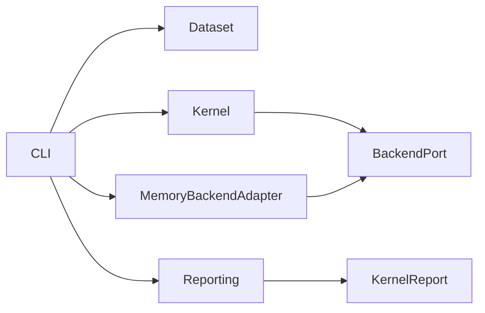

# MemoryOS-Bench architecture

Date: 2026-09-01
Profile: `controlled-v0.1`

## 1. Goal

MemoryOS-Bench measures retrieval correctness first, then curator quality and integrated engineering
benefit. Benchmark datasets, gold state, agent traces, run artifacts, and reports are owned by the
benchmark and must never become production MemoryOS data unless a scenario explicitly submits a gold
MemoryDelta to an isolated MemoryOS instance.

Implemented slices cover deterministic Kernel retrieval through public MemoryOS HTTP/MCP contracts and
formal Curator evaluation with MemoryOS fully bypassed. They do not change MemoryOS, implement Flat RAG,
or define Phase D/E judgments.

Success conditions:

- the package can be extracted from this repository without importing MemoryOS source files;
- fixtures and reports are versioned and schema-validated;
- scoring uses stable object IDs rather than text similarity;
- the runner depends on a backend capability port, not MCP SDK types;
- every live run targets an explicitly supplied MemoryOS endpoint and logical project IDs;
- raw benchmark artifacts stay under an ignored benchmark-owned directory.

## 2. Domain model

Core terms are Dataset, ProjectFixture, GoldDelta, RetrievalProbe, RankedObject, ProbeScore,
KernelReport, and RunManifest.

Invariants:

- IDs are unique within a dataset namespace;
- every delta and probe refers to a declared project;
- relevant and forbidden object sets do not overlap;
- each probe has at least one relevant object;
- ranking metrics preserve the backend order and compare typed object identities;
- failures are recorded per probe rather than hidden by one aggregate score.

The benchmark owns fixtures, metrics, run configuration, and reports. MemoryOS owns only the isolated
memory state exercised by a run.

## 3. Existing architecture impact

The first slices add one workspace package and root scripts only. Production service contracts,
FalkorDB schema, Docker volumes, and UI remain unchanged. The live adapter uses project registration
over `/api/v1/projects` and canonical tools over `/mcp`.

## 4. Decomposition

| Module | Responsibility | Owns | Does not own | Public API |
|---|---|---|---|---|
| dataset | Validate a controlled corpus | fixture schemas and cross-reference rules | filesystem traversal | `parseDataset` |
| kernel | Execute retrieval probes and calculate formal metrics | ranking/scoring semantics | MCP or report files | `runKernelBenchmark` |
| backend | Describe benchmark-required memory capabilities | backend-neutral observations/errors | SDK transports | `MemoryBackend` |
| memoryos adapter | Translate the backend port to public HTTP/MCP | connection lifecycle and contract mapping | scoring | `MemoryOsBackend` |
| reporting | Persist immutable run artifacts | JSON serialization, path preflight | metric calculation | `prepareJsonReportTarget`, `writeJsonReport` |
| CLI | Compose loader, adapter, runner, and report store | process arguments and exit codes | business rules | `memoryos-bench kernel` |

Dependency direction:

## 5. Ports and adapters

| Port | Business purpose | Adapter | Reason |
|---|---|---|---|
| `MemoryBackend` | Prepare projects/deltas and observe ranked retrieval | public MemoryOS HTTP/MCP | Memory backend is the tested replaceable system |
| `BenchmarkClock` | Timestamp reports deterministically in tests | system/fake clock | reproducible unit tests |

No generic agent, sandbox, telemetry, or baseline interfaces are added until their implementation stage.

## 6. Decisions and trade-offs

- The package lives in this monorepo for development convenience but imports no `apps/*` source.
- Initial fixtures use JSON. A YAML loader is deferred until a real YAML corpus exists.
- The public MCP ranking is treated as the observed backend behavior. Direct FalkorDB queries are not a
  valid retrieval result source.
- An opt-in Compose stand binds port `17310` and stores FalkorDB state in container `tmpfs`; its lifecycle
  never touches the production MemoryOS volume.
- Phase A11/A12 and curator lifecycle transitions remain capability gaps, not mocked successes.

## 7. Test strategy

- schema and cross-reference invariant tests;
- pure Recall@k/MRR/nDCG tests, including duplicate results and forbidden leakage;
- runner tests with an in-memory backend fake;
- adapter contract tests without importing MemoryOS internals;
- architecture test forbidding imports from `apps/service`, FalkorDB, or benchmark artifacts;
- opt-in live black-box smoke against localhost MemoryOS.

## 8. Ordered implementation

1. Add the standalone package, controlled profile, fixture schemas, and loader.
2. Implement typed object rankings and deterministic Kernel metrics.
3. Implement the runner over `MemoryBackend` with raw per-probe evidence.
4. Add the HTTP/MCP MemoryOS adapter and JSON report store.
5. Add a minimal two-project corpus and live command.
6. Add ephemeral Compose lifecycle before destructive or migration probes. (implemented for Kernel)
7. Build Curator and Integrated harnesses without changing MemoryOS. (Curator implemented; Integrated pending)
8. Use benchmark evidence to scope MemoryDelta v2, replay, and global knowledge changes.

## 9. Risks

- Running against the global instance can contaminate memory. The initial live command therefore refuses
  a target containing any declared fixture project unless `--allow-existing-projects` is explicit.
- Semantic ranking can vary with embedding model identity. Every report records backend readiness/model
  metadata and the dataset version.
- One aggregate score can hide harmful behavior. Reports retain every metric and every ranked object.
- Current MemoryOS Admin search fixes graph depth to one; the MCP search tool is used for full probe input.
