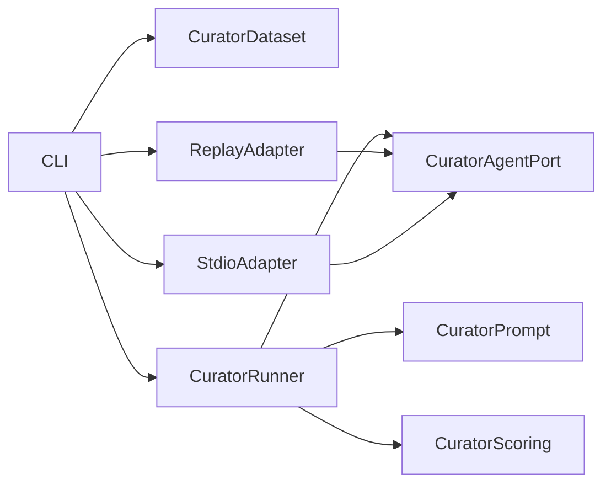

# Formal Curator harness architecture

Date: 2026-09-01
Profile: `curator-controlled-v0.1`

## 1. Goal

The Curator harness measures whether an agent turns a complete engineering episode and an explicit
prior-memory snapshot into the expected `MemoryDelta`. MemoryOS storage and retrieval are deliberately
bypassed, so a curator error cannot be hidden by backend ranking and a backend error cannot be counted
against the agent.

Actors are a benchmark author, an agent/orchestrator adapter, and a report consumer. The current slice
covers deterministic B1-B10 comparisons that can be expressed through canonical entities, claim triples,
labels, links, scopes, time ranges, and promotion annotations. Cleanup mutations and source-of-truth
promotion remain explicit capability gaps because the current public `MemoryDelta` is create-only and has
no docs/tests/rules promotion operation.

Success conditions:

- a curator run never connects to MemoryOS;
- every prompt includes the full episode, gold prior snapshot, versioned prompt, and versioned skill id;
- generated output is parsed through the same strict wire-level `MemoryDelta` contract as gold;
- canonical IDs score concepts/evidence/contexts while claim quality scores triples, not prose;
- raw generated output, parse failures, per-episode metrics, and agent identity remain in the report;
- an external agent can be replaced without changing curator scoring.

## 2. Domain model and invariants

Core terms are `CuratorDataset`, `Episode`, `PriorMemorySnapshot`, `CuratorOutput`, `CuratorAgent`,
`CuratorMetrics`, and `CuratorReport`.

Invariants:

- episode ids are unique and timestamps include an offset;
- all prior/gold entities belong to the episode project;
- gold relations target declared claims;
- generated entities outside the gold durable set reduce admission precision;
- weighted admission precision counts each false durable entity as two false positives and always retains
  the unweighted precision/recall/F1 beside it;
- claim identity for decomposition is `(subject_id, predicate, object_id)`, not statement text;
- epistemic/confidence/temporal accuracy is calculated only for matched gold claim triples;
- a gold scoped claim returned without its required context counts as over-generalization;
- promotion traps have a larger visible diagnostic than missed optional promotion;
- failed invocation or invalid JSON is a failed episode, never an omitted data point.

The benchmark owns episodes, prior snapshots, gold deltas, replay responses, prompts, and reports.
MemoryOS owns none of this state.

## 3. Decomposition

| Module | Responsibility | Owns | Does not own | Public API |
|---|---|---|---|---|
| curator dataset | Validate episodes and gold state | schemas and cross references | files or agent calls | `parseCuratorDataset` |
| curator prompt | Produce versioned, leak-free invocation request | prompt contract | provider message types | `createCuratorRequest` |
| curator scoring | Compare one generated output with gold | formal B metrics | invocation or aggregation | `scoreCuratorOutput` |
| curator runner | Invoke episodes and retain all outcomes | run sequencing/report aggregation | provider transport | `runCuratorBenchmark` |
| curator agent port | Request one reflection result | provider-neutral request/result | SDK/session types | `CuratorAgent` |
| replay adapter | Return versioned captured responses | response fixture parsing | scoring | `ReplayCuratorAgent` |
| stdio adapter | Invoke any orchestrator through JSON stdin/stdout | process lifecycle/protocol | prompt or metrics | `StdioCuratorAgent` |
| CLI | Select adapters and persist reports | argument composition | curator policy | `memoryos-bench curator` |

Dependency direction:

Curator domain and runner import no MCP, MemoryOS adapter, filesystem, or child-process type.

## 4. Ports and replaceability

| Port | Business purpose | Adapters | Replacement impact |
|---|---|---|---|
| `CuratorAgent` | Obtain one agent reflection for a complete episode | replay; stdio | adapter, wiring, adapter tests |
| `BenchmarkClock` | Timestamp and time calls | existing system/fake clock | clock adapter/tests |

The stdio protocol is one JSON request on stdin and one JSON result on stdout. It is intentionally not a
generic agent SDK abstraction: a Paseo, Codex, Claude, or local-model bridge owns provider-specific tool and
session behavior outside the benchmark.

Replay files bind dataset id/version, prompt version, and memory-skill version. A mismatch is a failed
episode rather than an implicit replay under changed experimental conditions. Reports label replay runs as
`calibration_replay` and stdio runs as `external_agent`.

## 5. Deliberate non-abstractions and trade-offs

- JSON remains the only corpus format until a YAML corpus exists.
- Replay is a reproducibility adapter, not a claim about live agent quality.
- No LLM judge is used for formal curator metrics; statement wording is retained but not scored.
- No synthetic cleanup or source-of-truth score is invented before `MemoryDelta` can represent those acts.
- Initial execution is sequential to keep response attribution and rate limiting explicit.

## 6. Test and implementation plan

1. Export the strict wire `MemoryDelta` schema and add Curator dataset cross-reference tests.
2. Implement set/triple/link metrics and over-generalization/promotion diagnostics as pure functions.
3. Implement the runner over a fake `CuratorAgent`, including parse and invocation failures.
4. Add replay and stdio adapters with contract tests.
5. Add a controlled admission/context/promotion corpus and captured oracle/faulty responses.
6. Extend the CLI and JSON report path without changing Kernel behavior.
7. Run unit, architecture, build, replay baseline, and an external stdio smoke.

## 7. Risks

- Canonical IDs can reward agents that have seen gold. Anti-leakage requires externally generated responses
  to receive only the invocation request; replay fixtures are labelled as evaluator calibration.
- A generated claim may be semantically correct with a different triple. This formal track intentionally
  scores the controlled ontology; semantic-quality judging belongs to Phase D.
- Current create-only deltas cannot express merge/invalidate-existing/source promotion. Reports list these as
  unsupported rather than silently assigning success.
