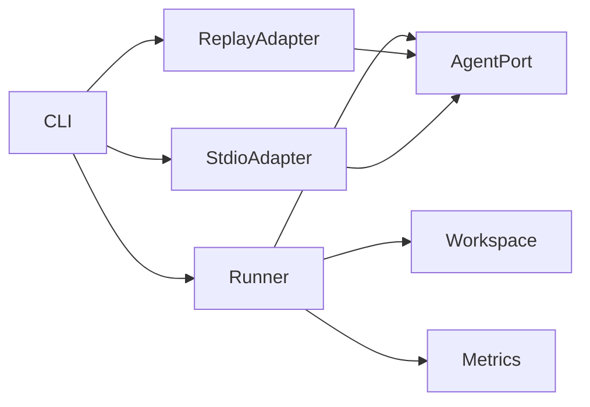

# Controlled Integrated harness architecture

Date: 2026-09-01
Profile: `integrated-controlled-v0.1`

## 1. Goal

Measure whether accumulated engineering memory changes task correctness, exploration cost, repeated
mistakes, and harmful transfer. Every scenario runs in all five required modes with identical task and
repository input: `no_memory`, `oracle_memory`, `oracle_writes`, `full_memory_os`, and `flat_rag`.

This slice owns a controlled structured-SWE environment. The agent receives a repository snapshot and
returns a decision, bounded file changes, trace events, memory citations, and cost. The harness applies
changes to a fresh in-memory workspace and validates exact repository state. This gives deterministic reset
and validation without executing corpus-supplied shell commands.

Initial reports are evaluator calibration replays. They MUST NOT be presented as live model quality.
Provider-specific stdio runs are labelled `external_agent`; their adapter is responsible for accurate trace
and token telemetry.

## 2. Domain model and invariants

Core terms: `IntegratedDataset`, `Scenario`, `ExperimentalMode`, `RepositorySnapshot`, `MemoryItem`,
`IntegratedAgent`, `AgentRun`, `ScenarioValidation`, `ModeStatistics`, and `IntegratedReport`.

Invariants:

- all five modes are executed for every scenario and repetition;
- model/prompt/toolset versions are fixed by one agent descriptor per report;
- repository input is cloned before every run and file changes cannot escape declared paths;
- validation is based on expected decision and exact expected files, not agent self-report;
- trace and token cost remain a vector; no hidden composite score replaces them;
- replay files bind dataset, prompt, toolset, and response-contract versions;
- Memory Harm requires paired no-memory success, full-memory failure, and an explicitly harmful memory use;
- a failed invocation or invalid output remains a failed run;
- statistics retain raw runs and report mean, median, sample deviation, and 95% normal CI when applicable.

## 3. Decomposition

| Module | Responsibility | Owns | Does not own | Public API |
|---|---|---|---|---|
| integrated dataset | Validate scenarios, modes, gold repository state | schemas/cross refs | agent transport | `parseIntegratedDataset` |
| workspace | Clone, bound and validate repository changes | path/state invariants | agent reasoning | `evaluateWorkspaceResult` |
| integrated metrics | Pair modes and derive gaps/harm/transfer/statistics | metric formulas | invocation | `calculateIntegratedMetrics` |
| integrated runner | Execute scenario × mode × repetition | sequencing/raw outcomes | provider protocol | `runIntegratedBenchmark` |
| integrated agent port | Run one controlled SWE task | provider-neutral request/result | validation | `IntegratedAgent` |
| replay adapter | Reproduce calibration outcomes | version-bound fixture | scoring | `ReplayIntegratedAgent` |
| stdio adapter | Bridge external orchestrators | process/JSON protocol/timeout | metrics | `StdioIntegratedAgent` |
| CLI | Composition and report persistence | configuration | policies | `memoryos-bench integrated` |

Integrated policy imports no MCP SDK, filesystem, child-process, or MemoryOS adapter. A later real
`oracle_writes/full_memory_os` context provider may use the public MemoryOS port without changing metrics.

## 4. Ports and replaceability

`IntegratedAgent` is the only required runtime port. Replay calibrates evaluation; stdio supports Paseo,
Codex, Claude, or another orchestrator without SDK coupling. Memory context is explicit in each request, so
the current harness can measure mode semantics now while a later MemoryOS context-provider adapter replaces
only context acquisition for real backend measurements.

## 5. Deliberate trade-offs

- Initial repository validation is exact file/decision validation, not arbitrary build commands.
- Agent telemetry from stdio is adapter-reported and labelled as such; wall time is measured by the harness.
- Three repetitions are the default minimum; calibration replay can be deterministic across repetitions.
- Flat RAG context is corpus-controlled in this slice; vector retrieval cost is not claimed until a real
  baseline adapter is connected.
- No LLM judge or semantic score is invented.

## 6. Ordered implementation and tests

1. Add schemas for scenarios, all modes, bounded changes, trace and memory citations.
2. Add pure workspace validation and paired/statistical metrics.
3. Add runner over a fake agent, including failures and three repetitions.
4. Add version-bound replay and provider-neutral stdio adapters.
5. Add positive-reuse and stale-negative-transfer controlled scenarios.
6. Add CLI/report, calibration run, architecture tests, full workspace regression.
7. Connect a real orchestrator and real MemoryOS/Flat-RAG context providers; keep calibration separate.
